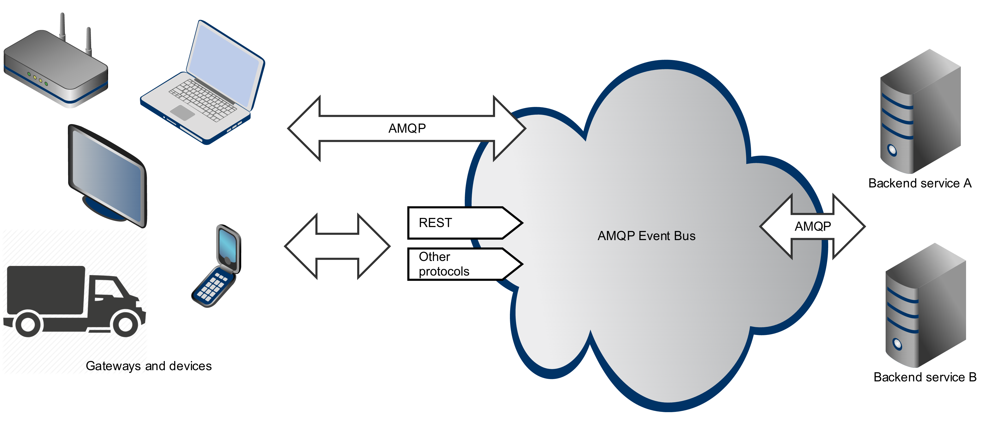

# Smolok - Big Data for connected devices

Smolok is a big data platform for connected devices, where *device* can be a piece of the IoT (Internet Of Things) hardware,
smart phone, tablet, web browser or external IT system.

The idea behind Smolok is to deliver a scalable backend PaaS platform providing core services required by
device-oriented system. List of such services includes big data analytics, IoT-scale messaging infrastructure,
device management, telemetry reading/writing and so forth.

Smolok is based on the top of the leading open source projects including [Apache Spark](http://spark.apache.org) and
[Eclipse IoT stack](http://iot.eclipse.org) (particularly on the [Eclipse Kapua](https://projects.eclipse.org/proposals/eclipse-kapua) project).

## Documentation

Documentation of the project can be found [here](docs/documentation.md).

## Credits

Vintage unicorn logo has been designed by [Freepik](http://www.freepik.com/free-photos-vectors/vintage).